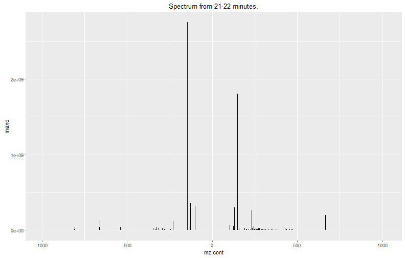
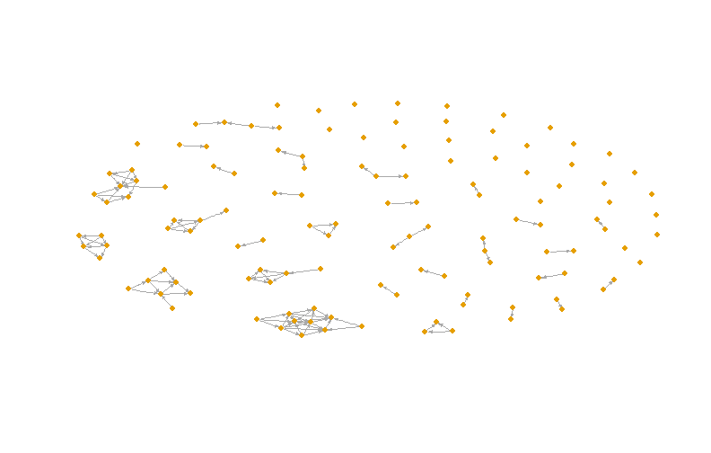
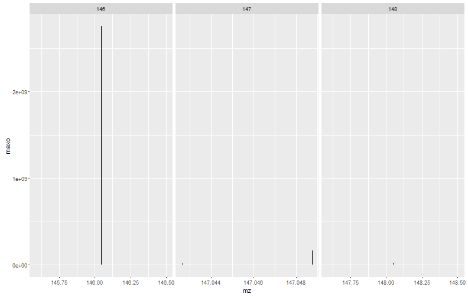
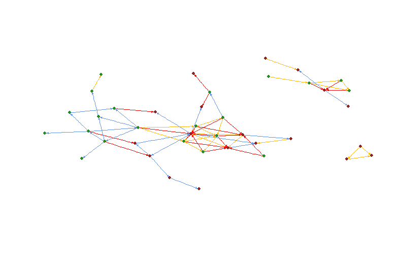
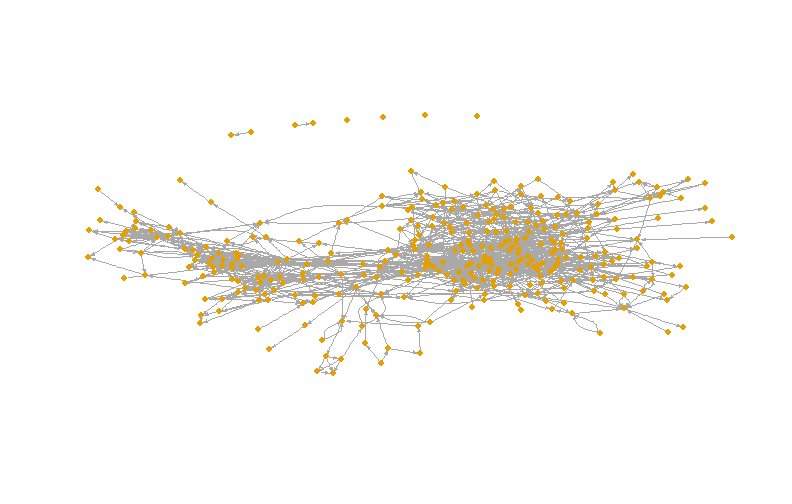
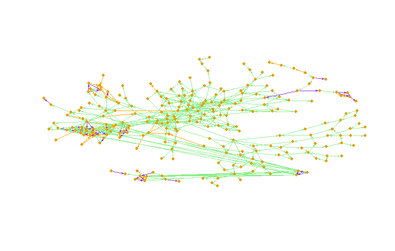
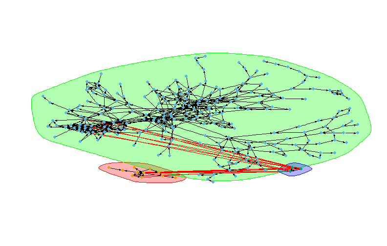

# Example mz.unity usage
This example follows the analysis published in X.

### Load Data

```r
library(mz.unity)

spectrum = read.csv("glunad_spec.csv")

head(spectrum)
```

```
##         mz    mzmin    mzmax      rt   rtmin   rtmax        into
## 1 146.0455 146.0455 146.0456 1290.44 1275.30 1307.26 40160352716
## 2 128.0351 128.0351 128.0351 1290.44 1275.30 1307.26  5087560766
## 3 102.0559 102.0558 102.0559 1290.44 1275.30 1307.26  4403967592
## 4 147.0488 147.0487 147.0488 1290.44 1275.30 1307.26  2331910908
## 5 662.1020 662.1018 662.1023 1300.50 1286.54 1314.06   972621877
## 6 231.0984 231.0983 231.0985 1291.00 1276.43 1305.00  1123081171
##          intb       maxo    sn id   mz.cont source
## 1 40158549546 2755929856 25072  1 -146.0455    psn
## 2  5085339777  352001536  8221  2 -128.0351    psn
## 3  4402444476  311817472  7226  3 -102.0559    psn
## 4  2331403605  164391280  6270  4 -147.0488    psn
## 5   972497970  136589984 12084  5 -662.1020    psn
## 6  1122893150  114501544 10999  6 -231.0984    psn
```
This spectrum was compiled from positive and negative mode scans from an LC/ESI/MS analysis of E. coli MG1655.  HILIC mode separation was employed with a Luna NH2 column coupled to a Q-Exactive Plus orbitrap mass spectrometer.


```r
plyr::count(spectrum$source)
```

```
##     x freq
## 1 bgn  777
## 2 bgp 1435
## 3 psn  109
## 4 psp  345
```

```r
ggplot(spectrum) + geom_segment(aes(x = mz.cont, xend = mz.cont, y = maxo, yend = 0)) + ggtitle("Spectrum from 21-22 minutes.")
```



### Format data for mz.unity


```r
mz = spectrum
mz$m = spectrum$mz
mz$z = sign(spectrum$mz.cont)
mz$d = 1
mz$source = spectrum$source
mz$id = seq(nrow(mz))
mz$row = seq(nrow(mz))

head(mz)
```

```
##         mz    mzmin    mzmax      rt   rtmin   rtmax        into
## 1 146.0455 146.0455 146.0456 1290.44 1275.30 1307.26 40160352716
## 2 128.0351 128.0351 128.0351 1290.44 1275.30 1307.26  5087560766
## 3 102.0559 102.0558 102.0559 1290.44 1275.30 1307.26  4403967592
## 4 147.0488 147.0487 147.0488 1290.44 1275.30 1307.26  2331910908
## 5 662.1020 662.1018 662.1023 1300.50 1286.54 1314.06   972621877
## 6 231.0984 231.0983 231.0985 1291.00 1276.43 1305.00  1123081171
##          intb       maxo    sn id   mz.cont source        m  z d row
## 1 40158549546 2755929856 25072  1 -146.0455    psn 146.0455 -1 1   1
## 2  5085339777  352001536  8221  2 -128.0351    psn 128.0351 -1 1   2
## 3  4402444476  311817472  7226  3 -102.0559    psn 102.0559 -1 1   3
## 4  2331403605  164391280  6270  4 -147.0488    psn 147.0488 -1 1   4
## 5   972497970  136589984 12084  5 -662.1020    psn 662.1020 -1 1   5
## 6  1122893150  114501544 10999  6 -231.0984    psn 231.0984 -1 1   6
```

#### Find peaks with isotope support for Z = 2

```r
mz2 = mz; mz2$m = mz2$m * 2; mz2$z = mz2$z * 2
```


```r
ps = mz2[which(mz2$source %in% c("psp","psn")),]
pIso2 = mz.unity.search(A = ps, 
                        B = ps, 
                        M = M.iso, ppm = 1, 
                        BM.limits = cbind(M.min = c(1), M.max = c(1), B.n = c(1)))
pIso2 = reindex(pIso2, '^A$|^A.|^B$|^B.', ps$row)

head(pIso2)
```

```
##      A        ppm M.1 B.1
## 1   25 -0.1904717   1   5
## 2   10  0.1236177   1  25
## 3   57  0.3110863   1  48
## 4   94 -0.8560973   1  57
## 5 1015  0.3189293   1 921
## 6 1083  0.3035952   1 938
```
Here we can see the z=2 isotope support detected in our spectrum.  In the first row, mz2[5,] plus granular formula M[1,] results in mz2[25,].  This is the M+1 carbon isotope of glutamate.

We do the same for background peaks:

```r
ps = mz2[which(mz2$source %in% c("bgp","bgn")),]
pIso2b = mz.unity.search(A = ps, 
                        B = ps, 
                        M = M.iso, ppm = 1, 
                        BM.limits = cbind(M.min = c(1), M.max = c(1), B.n = c(1)))
pIso2b = reindex(pIso2b, '^A$|^A.|^B$|^B.', ps$row)


mz2$monoiso = seq(nrow(mz2)) %in% c(pIso2$B.1, pIso2b$B.1) & !(seq(nrow(mz2)) %in% c(pIso2$A, pIso2b$A))
mz2$iso = seq(nrow(mz2)) %in% c(pIso2$B.1, pIso2b$B.1) | (seq(nrow(mz2)) %in% c(pIso2$A, pIso2b$A))
```
And record which ones have isotope support.  We assume all the rest are Z=1 peaks.

#### Find peaks with isotope support for Z = 1


```r
ps = mz[which(mz$source %in% c("psp","psn")),]
pIso = mz.unity.search(A = ps, 
                        B = ps, 
                        M = M.iso, ppm = 1, 
                        BM.limits = cbind(M.min = c(1), M.max = c(1), B.n = c(1)))
pIso = reindex(pIso, '^A$|^A.|^B$|^B.', ps$row)


ps = mz[which(mz$source %in% c("bgp","bgn")),]
pIsob = mz.unity.search(A = ps, 
                        B = ps, 
                        M = M.iso, ppm = 1, 
                        BM.limits = cbind(M.min = c(1), M.max = c(1), B.n = c(1)))
pIsob = reindex(pIsob, '^A$|^A.|^B$|^B.', ps$row)


mz$monoiso = seq(nrow(mz)) %in% c(pIso$B.1, pIsob$B.1) & !(seq(nrow(mz)) %in% c(pIso$A, pIsob$A))
mz$iso = seq(nrow(mz)) %in% c(pIso$B.1, pIsob$B.1) | (seq(nrow(mz)) %in% c(pIso$A, pIsob$A))

mzz = rbind(mz, subset(mz2, iso))
mzz$row = seq(mzz$row)
```


#### Annotate simple relationships


```r
ps = mzz[which(mzz$source %in% c("psp","psn") & ( mzz$monoiso | !mzz$iso )),]
pPol = mz.unity.search(A = ps, 
                       B = ps, 
                       M = M.z, ppm = 10, 
                       BM.limits = cbind(M.min = c(2), M.max = c(2), B.n = c(1))
                       )
pPol = reindex(pPol, '^M$|^M.', M.z$id)
pPol = subset(pPol, sign(ps[pPol$A, "z"]) != sign(ps[pPol$B.1,"z"]))
pPol = reindex(pPol, '^A$|^A.|^B$|^B.', ps$row)


ps = mzz[which(mzz$source %in% c("psp","psn") & ( mzz$monoiso | !mzz$iso )),]
pNl = mz.unity.search(A = ps, 
                      B = ps, 
                      M = M.n, ppm = 2, 
                      BM.limits = cbind(M.min = c(1), M.max = c(1), B.n = c(1))
                      )
pNl = reindex(pNl, '^M$|^M.', M.n$id)
pNl = reindex(pNl, '^A$|^A.|^B$|^B.', ps$row)


ps = mzz[which(mzz$source %in% c("psp","psn") & ( mzz$monoiso | !mzz$iso )),]
pZ = mz.unity.search(A = ps, 
                      B = ps, 
                      M = M.z, ppm = 2, 
                      BM.limits = cbind(M.min = c(1), M.max = c(2), B.n = c(1))
                      )
pZ = subset(pZ, sign(ps[pZ$A, "z"]) == sign(ps[pZ$B.1,"z"]))
pZ = reindex(pZ, '^A$|^A.|^B$|^B.', ps$row)
```


#### Annotate Analyte-Analyte Mers and Distal Fragments

```r
options(expressions=10000)

ps = mzz[which(mzz$source %in% c("psn") & ( mzz$monoiso | !mzz$iso )),] 
ms = subset(M.z, id == 11,drop=F)
pMern = mz.unity.search(A = ps, 
                        B = ps, 
                        M = ms, ppm = 2, 
                        BM.limits = cbind(M.min = c(1), M.max = c(1), B.n = c(2))
                        )
pMern = reindex(pMern, '^M$|^M.', ms$id)
pMern = reindex(pMern, '^A$|^A.|^B$|^B.', ps$row)


ps = mzz[which(mzz$source %in% c("psp") & ( mzz$monoiso | !mzz$iso )),] 
ms = subset(M.z, id == 11,drop=F)
pMerp = mz.unity.search(A = ps, 
                        B = ps, 
                        M = ms, ppm = 2, 
                        BM.limits = cbind(M.min = c(1), M.max = c(1), B.n = c(2))
                        )
pMerp = reindex(pMerp, '^M$|^M.', ms$id)
pMerp = reindex(pMerp, '^A$|^A.|^B$|^B.', ps$row)

pMer = rbind(pMerp, pMern)
```

#### Considering only peaks with isotope support - Annotate Analyte-Analyte Mers and Distal Fragments


```r
options(expressions=10000)

ps = mzz[which(mzz$source %in% c("psn") & ( mzz$monoiso )),] 
ms = subset(M.z, id == 11,drop=F)
pMern = mz.unity.search(A = ps, 
                        B = ps, 
                        M = ms, ppm = 2, 
                        BM.limits = cbind(M.min = c(1), M.max = c(1), B.n = c(2))
                        )
pMern = reindex(pMern, '^M$|^M.', ms$id)
pMern = reindex(pMern, '^A$|^A.|^B$|^B.', ps$row)


ps = mzz[which(mzz$source %in% c("psp") & ( mzz$monoiso )),] 
ms = subset(M.z, id == 11,drop=F)
pMerp = mz.unity.search(A = ps, 
                        B = ps, 
                        M = ms, ppm = 2, 
                        BM.limits = cbind(M.min = c(1), M.max = c(1), B.n = c(2))
                        )
pMerp = reindex(pMerp, '^M$|^M.', ms$id)
pMerp = reindex(pMerp, '^A$|^A.|^B$|^B.', ps$row)

pMerI = rbind(pMerp, pMern)
```


##### Annotate Cross Polarity Mers and Distal Fragments

```r
options(expressions=10000)

ps = mzz[which(mzz$source %in% c("psp", "psn") & ( mzz$monoiso | !mzz$iso )),] 
ms = subset(M.z, id == 11,drop=F)
pFrag = mz.unity.search(A = ps, 
                        B = ps, 
                        M = ms, ppm = 2, 
                        BM.limits = cbind(M.min = c(1), M.max = c(1), B.n = c(2))
                        )
pFrag = subset(pFrag, xor(ps$source[B.1] == "psp", ps$source[B.2] == "psp"))
pFrag = reindex(pFrag, '^M$|^M.', ms$id)
pFrag = reindex(pFrag, '^A$|^A.|^B$|^B.', ps$row)
```


####  Considering only peaks with isotope support - Annotate Cross Polarity Mers and Distal Fragments

```r
options(expressions=10000)

ps = mzz[which(mzz$source %in% c("psp", "psn") & ( mzz$monoiso )),] 
ms = subset(M.z, id == 11,drop=F)
pFragI = mz.unity.search(A = ps, 
                        B = ps, 
                        M = ms, ppm = 2, 
                        BM.limits = cbind(M.min = c(1), M.max = c(1), B.n = c(2))
                        )
pFragI = subset(pFragI, xor(ps$source[B.1] == "psp", ps$source[B.2] == "psp"))
pFragI = reindex(pFragI, '^M$|^M.', ms$id)
pFragI = reindex(pFragI, '^A$|^A.|^B$|^B.', ps$row)
```

##### Annotate Background Mers

```r
options(expressions=40000)

psa = mzz[which(mzz$source %in% c("psn") & ( mzz$monoiso | !mzz$iso )),] 
psb = rbind(
  mzz[which(mzz$source %in% c("psn") & ( mzz$monoiso | !mzz$iso )),],
  mzz[which(mzz$source %in% c("bgn") & ( mzz$monoiso )),]
  )
ms = subset(M.z, id == 11,drop=F)
pMernb = mz.unity.search(A = psa, 
                        B = psb, 
                        M = ms, ppm = 2, 
                        BM.limits = cbind(M.min = c(1), M.max = c(1), B.n = c(2))
                        )
pMernb = subset(pMernb, xor(psb$source[B.1] == "psn", psb$source[B.2] == "psn"))
pMernb = reindex(pMernb, '^M$|^M.', ms$id)
pMernb = reindex(pMernb, '^A$|^A.', psa$row)
pMernb = reindex(pMernb, '^B$|^B.', psb$row)


psa = mzz[which(mzz$source %in% c("psp") & ( mzz$monoiso | !mzz$iso )),] 
psb = rbind(
  mzz[which(mzz$source %in% c("psp") & ( mzz$monoiso | !mzz$iso )),],
  mzz[which(mzz$source %in% c("bgp") & ( mzz$monoiso )),]
  )
ms = subset(M.z, id == 11,drop=F)
pMerpb = mz.unity.search(A = psa, 
                        B = psb, 
                        M = ms, ppm = 2, 
                        BM.limits = cbind(M.min = c(1), M.max = c(1), B.n = c(2))
                        )
pMerpb = subset(pMerpb, xor(psb$source[B.1] == "psp", psb$source[B.2] == "psp"))
pMerpb = reindex(pMerpb, '^M$|^M.', ms$id)
pMerpb = reindex(pMerpb, '^A$|^A.', psa$row)
pMerpb = reindex(pMerpb, '^B$|^B.', psb$row)

pBgMer = rbind(pMernb, pMerpb)
```
#### Considering only peaks with isotope support - Annotate Background Mers

```r
options(expressions=20000)

psa = mzz[which(mzz$source %in% c("psn") & ( mzz$monoiso )),] 
psb = rbind(
  mzz[which(mzz$source %in% c("psn") & ( mzz$monoiso )),],
  mzz[which(mzz$source %in% c("bgn") & ( mzz$monoiso )),]
  )
ms = subset(M.z, id == 11,drop=F)
pMernb = mz.unity.search(A = psa, 
                        B = psb, 
                        M = ms, ppm = 2, 
                        BM.limits = cbind(M.min = c(1), M.max = c(1), B.n = c(2))
                        )
pMernb = subset(pMernb, xor(psb$source[B.1] == "psn", psb$source[B.2] == "psn"))
pMernb = reindex(pMernb, '^M$|^M.', ms$id)
pMernb = reindex(pMernb, '^A$|^A.', psa$row)
pMernb = reindex(pMernb, '^B$|^B.', psb$row)


psa = mzz[which(mzz$source %in% c("psp") & ( mzz$monoiso )),] 
psb = rbind(
  mzz[which(mzz$source %in% c("psp") & ( mzz$monoiso )),],
  mzz[which(mzz$source %in% c("bgp") & ( mzz$monoiso )),]
  )
ms = subset(M.z, id == 11,drop=F)
pMerpb = mz.unity.search(A = psa, 
                        B = psb, 
                        M = ms, ppm = 2, 
                        BM.limits = cbind(M.min = c(1), M.max = c(1), B.n = c(2))
                        )
pMerpb = subset(pMerpb, xor(psb$source[B.1] == "psp", psb$source[B.2] == "psp"))
pMerpb = reindex(pMerpb, '^M$|^M.', ms$id)
pMerpb = reindex(pMerpb, '^A$|^A.', psa$row)
pMerpb = reindex(pMerpb, '^B$|^B.', psb$row)

pBgMerI = rbind(pMernb, pMerpb)
```

### Aggregate Relationships

```r
pZ$rel = "z"
pPol$rel = "pol"
pNl$rel = "nl"
pMer$rel = "mer"
pMerI$rel = "meri"
pFrag$rel = "frag"
pFragI$rel = "fragi"
pBgMer$rel = "bg"
pBgMerI$rel = "bgi"

rels = do.call(plyr::rbind.fill, list(
  pZ,
  pPol,
  pNl,
  pMer,
  pFrag,
  pBgMer,
  pBgMerI,
  pFragI,
  pMerI
  ))
```


```r
plyr::count(mz$source)
```

```
##     x freq
## 1 bgn  777
## 2 bgp 1435
## 3 psn  109
## 4 psp  345
```
Peak relationships with Z = 1

```r
plyr::count(mzz$source)
```

```
##     x freq
## 1 bgn  860
## 2 bgp 1716
## 3 psn  130
## 4 psp  365
```
Peak relationships with Z = 1 and 2


```r
plyr::count(rels$rel)
```

```
##       x freq
## 1    bg  474
## 2   bgi   10
## 3  frag  137
## 4 fragi   11
## 5   mer  283
## 6  meri    8
## 7    nl  284
## 8   pol   52
## 9     z   52
```
Types of relationships detected

## Plot Charge Carriers


```r
df = subset(rels, rel %in% c("z", "pol"))
df = reindex(df, '^A$|^A.|^B$|^B.', mzz$id)

vertices = c(unique(subset(mzz, monoiso & source %in% c("psn", "psp"))[,"id"]))
vertices = unique(c(vertices, unlist(expandGraph(df)[,1:2])))

g = graph.data.frame(expandGraph(df)[,1:2], vertices = data.frame(v=as.character(vertices)))
plot(g, asp = .4, vertex.size = 2, edge.arrow.mode=1, edge.arrow.size = 0.3, vertex.label.cex=.6, vertex.frame.color='transparent', vertex.label.color = "transparent")
```



```r
length(decompose(g))
```

```
## [1] 61
```


## Aggregate and Plot Fine Isotopic Spectrum from relationship graph

```r
isos = aggregate.children(pIso, 1)

df = mzz[isos,]
df$group = round(df$mz)
ggplot(df) + geom_segment(aes(x = mz, xend = mz, y = maxo, yend = 0)) + facet_grid(.~group, scales="free")
```



## Examine ambiguous neutral losses


```r
df = subset(rels, rel %in% "nl")
df$ambig = df$M.1 %in% c(16,18) 
nrow(df)
```

```
## [1] 284
```

```r
cnts = plyr::count(df$M.1)
cnts$name = rownames(M.n)[match(cnts$x,M.n$id)]
cnts
```

```
##     x freq     name
## 1  16   50     -H2O
## 2  17   19     -CO2
## 3  18   41     -NH3
## 4  19   20   +HCOOH
## 5  20   15 +CH3COOH
## 6  22   47   +CH3CN
## 7  23   32   +CH3OH
## 8  24   43      -CO
## 9  25    3   +H3PO4
## 10 26    6  +SiO3H2
## 11 27    4  +SiO4H4
## 12 28    4 +SiC2H6O
```

```r
plyr::count(subset(df, rel %in% "nl", "ambig"))
```

```
##   ambig freq
## 1 FALSE  193
## 2  TRUE   91
```

## Plot all simple relationships

```r
df = subset(rels, rel %in% c("z", "pol", "nl"))
df = reindex(df, '^A$|^A.|^B$|^B.', mzz$id)

vertices = c(unique(subset(mzz, monoiso & source %in% c("psn", "psp"))[,"id"]))
vertices = unique(c(vertices, unlist(expandGraph(df)[,1:2])))

g = graph.data.frame(expandGraph(df)[,1:2], vertices = data.frame(v=as.character(vertices)))
plot(g, asp = .4, vertex.size = 2, edge.arrow.mode=1, edge.arrow.size = 0.3, vertex.label.cex=.6, vertex.frame.color='transparent', vertex.label.color = "transparent")
```


```r
edgetypes = cbind(
  rel = c("nl", "pol", "z"),
  label = c("NL", "Polarity", "Charge"),
  color = c("cornflowerblue", "red", "darkgoldenrod1")
  )

spec = mzz[,c("mz.cont", "id", "maxo")]
colnames(spec) =c("mz", "id", "int")

dft = cbind(df, g = aggregate.self(df, F))

plyr::count(dft$g.A)
```

```
##     x freq
## 1   1   10
## 2   2   55
## 3   3   10
## 4   4    3
## 5   5    3
## 6   6  106
## 7   7  180
## 8   8    2
## 9   9    1
## 10 10    1
## 11 11    4
## 12 12    1
## 13 13    1
## 14 14    1
## 15 15    1
## 16 16    2
## 17 17    1
## 18 18    1
## 19 19    1
## 20 20    1
## 21 21    1
## 22 22    1
## 23 23    1
```

```r
subset(dft, A %in% c(1, 5, 9))
```

```
##     A        ppm M.1 M.2  B.1 rel B.2 g.A g.B.1 g.B.2
## 59  1  4.0725661 -11 -11  887 pol  NA   2     2    NA
## 61  5  0.3508200 -11 -11  890 pol  NA   1     1    NA
## 84  1  2.9514973 -11 -12  961 pol  NA   2     2    NA
## 85  5  0.1921316 -11 -12  989 pol  NA   1     1    NA
## 91  1  2.6131650 -11 -13  951 pol  NA   2     2    NA
## 92  5  0.1461191 -11 -13  975 pol  NA   1     1    NA
## 99  1  2.8133256 -12 -12 1116 pol  NA   2     2    NA
## 101 1  2.3432135 -12 -13 1039 pol  NA   2     2    NA
## 103 1  2.3761032 -13 -13 1066 pol  NA   2     2    NA
## 215 1 -1.3034641  19  NA   98  nl  NA   2     2    NA
```

```r
subset(dft, B.1 %in% c(1, 5, 9))
```

```
##      A        ppm M.1 M.2 B.1 rel B.2 g.A g.B.1 g.B.2
## 2   30  0.3917306   2  -1   1   z  NA   2     2    NA
## 4   49  0.1214004   2  -1   9   z  NA   4     4    NA
## 15  37  0.2603631   3  -1   1   z  NA   2     2    NA
## 18  36 -0.1570811   3  -1   9   z  NA   4     4    NA
## 105  2  0.4183592  16  NA   1  nl  NA   2     2    NA
## 155  3  0.6215201  17  NA   1  nl  NA   2     2    NA
## 174 32  0.5875019  18  NA   1  nl  NA   2     2    NA
## 372 45  0.8334535  25  NA   1  nl  NA   2     2    NA
## 373 50 -0.3629612  25  NA   5  nl  NA   1     1    NA
## 381 28 -0.2302001  27  NA   5  nl  NA   1     1    NA
```

```r
dft2 = subset(dft, g.A %in% c(1, 2, 4))
unity.graph(dft2, spec, edgetypes)
```




## Plot of relationships including mers and fragments
Note that not all of these relationships imply that all peaks involved are from the same compound.

```r
df = subset(rels, rel %in% c("z", "pol", "nl", "frag", "mer"))
df = reindex(df, '^A$|^A.|^B$|^B.', mzz$id)

vertices = c(unique(subset(mzz, monoiso & source %in% c("psn", "psp"))[,"id"]), 22)
vertices = unique(c(vertices, unlist(expandGraph(df)[,1:2])))

g = graph.data.frame(expandGraph(df)[,1:2], vertices = data.frame(v=as.character(vertices)))
plot(g, asp = .4, vertex.size = 2, edge.arrow.mode=1, edge.arrow.size = 0.3, vertex.label.cex=.6, vertex.frame.color='transparent', vertex.label.color = "transparent")
```



```r
length(decompose(g))
```

```
## [1] 7
```


## Explore Glutamate and NAD Cluster

```r
tmprels1 = subset(rels, rel %in% c("nl", "pol", "z"))
tmprels2 = subset(rels, rel %in% c("xmer", "frag"))
tmprels = rbind(tmprels1, tmprels2)
tmprels = cbind(tmprels, g = aggregate.self(tmprels))
head(tmprels)
```

```
##     A         ppm M.1 M.2  B.1 rel B.2 g.A g.B.1 g.B.2
## 1 890  0.11723379  -1  NA 2776   z  NA   1     1    NA
## 2  30  0.39173065   2  -1    1   z  NA   2     2    NA
## 3  51 -0.08590652   2  -1    8   z  NA   2     2    NA
## 4  49  0.12140040   2  -1    9   z  NA   3     3    NA
## 5  14  0.01863275   2  -1   13   z  NA   2     2    NA
## 6 106  0.02596370   2  -1   14   z  NA   2     2    NA
```
Columns starting with g are the compound groups.  This assumes that all detected mers are mers and not fragments and that no ambiguous relationships connect distinct analytes.


```r
gi = matrix(c(unlist(tmprels[,grep('^A|^B.', colnames(tmprels))]), unlist(tmprels[,grep('^g.', colnames(tmprels))])), ncol = 2, dimnames = list(NULL, c("i", "g")))
gi = unique(data.frame(gi))
gi = gi[!is.na(gi$g),]

g.glu = subset(gi, i == 1)$g
g.nad = subset(gi, i == 5)$g
g.glunad = subset(gi, i == 9)$g
gs = c(g.glu, g.nad, g.glunad)

head(gi)
```

```
##     i g
## 1 890 1
## 2  30 2
## 3  51 2
## 4  49 3
## 5  14 2
## 6 106 2
```
There are many groups but we are only going to plot those containing glutamate, nad and their dimer.


```r
agroup = subset(gi, g %in% gs)
rels.1 = subset(tmprels, (g.A %in% gs & g.B.1 %in% gs & (g.B.2 %in% gs | is.na(g.B.2))))
rels.1$rel[rels.1$rel == "mer" & rels.1$g.A == rels.1$g.B.1] = "mer.self"

es = expandGraph(rels.1)
es$rel = rels.1[es$row, "rel"]
es$color = c("lightgreen", "lightgreen", "orange", "blueviolet", "blueviolet", "blue", "red", "blue", "blue", "blue")[as.numeric(factor(es$rel))]
vs = unique(unlist(es[,1:2]))

es.l = expandGraph(subset(rels.1, g.A == g.B.1))
g.l = graph.data.frame(es.l, vertices = vs)
l = layout.auto(g.l)

g = graph.data.frame(es, vertices = vs)
plot(g, asp = .4, vertex.size = 2, edge.arrow.mode=1, edge.arrow.size = 0.3, vertex.label.cex=.6, vertex.frame.color='transparent', vertex.label.color = "transparent", layout = l)
```



```r
mat = match(as.numeric(V(g)$name), gi$i)
c2 = list(membership = gi$g[mat], names = as.character(gi$i)[mat])
class(c2) = "communities"
plot(c2, g, asp = .4, vertex.size = 2, edge.arrow.mode=1, edge.arrow.size = 0.3, vertex.label.cex=.6, vertex.frame.color='transparent', vertex.label.color = "transparent", layout = l)
```



