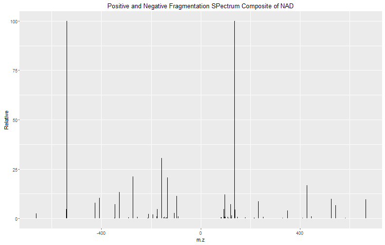
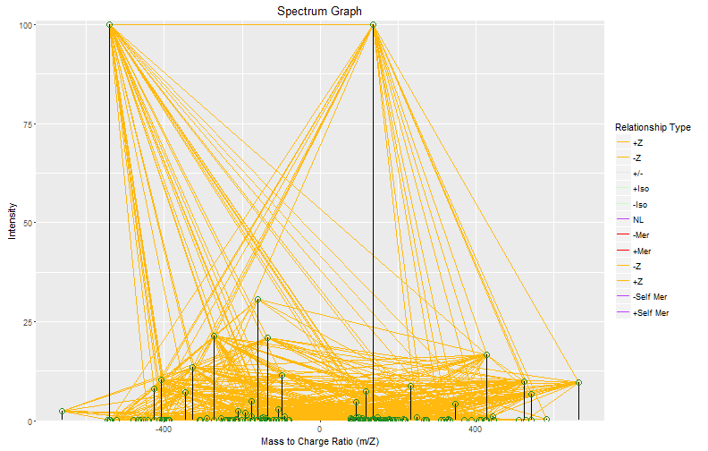

# Fragmentation of NAD
MS/MS was performed on the protonated and deprotonated forms of NAD.  Several collision energies were averaged.  Within this dataset we searched for pairs of distal fragments.


```r
library(mz.unity)
```

## Data

```r
nad = read.csv("nad_fragments.csv")
head(nad)
```

```
##         m.z Intensity Relative Resolution
## 1 -540.0535  484353.3   100.00   182617.5
## 2 -158.9251  148066.2    30.57   318861.0
## 3 -272.9570  103305.1    21.33   248166.9
## 4 -134.0470  100870.7    20.83   352184.9
## 5 -328.0451   64619.5    13.34   231726.4
## 6  -96.9694   55217.6    11.40   423695.9
```

```r
ggplot(nad) + geom_segment(aes(x = m.z, xend = m.z, y = Relative, yend = 0)) + ggtitle("Positive and Negative Fragmentation SPectrum Composite of NAD")
```



## Annotate

```r
M.z = M.z[1,,drop=F]
M.z
```

```
##    z        m   p d id
## H+ 1 1.007825 0.9 0 11
```
Only consider changes in protonation state because the targeted ions were only protonated.


```r
A = data.frame(nad[,"m.z",drop=F])
names(A) = "m"
A$z = sign(A$m)
A$m = abs(A$m)
A$d = 1
```
Format data for mz.unity

### Remove isotopes

```r
isos = mz.unity.search(A, A, M.iso, ppm = 2, BM.limits = cbind(M.min = c(1), M.max = c(1), B.n = c(1)))

isos.tf = seq(nrow(A)) %in% isos[,"A"]
A = A[!isos.tf,]
spec = nad[!isos.tf,]
```

### Detect Distal Fragments

```r
frags = mz.unity.search(A, A, M.z, ppm = 2, BM.limits = cbind(M.min = c(1), M.max = c(1), B.n = c(2)))
```
BM.limits forces the addition or loss of one proton in the relationship and the relationship between two peaks from B (fragments) and one from A (parent).


### Detect common neutral losses

```r
M.n = M.n[c(1:3, 9),]
nls = mz.unity.search(A, A, M.n, ppm = 2, BM.limits = cbind(M.min = c(1), M.max = c(1), B.n = c(1)))
```
BM.limits here forces the addition or loss of one neutral formula in the relationship and the relationship between one peaks from B and one from A.

## Make some pretty plots

```r
spec = spec[,c("m.z", "Relative")]
colnames(spec) = c("mz", "int")
spec$g = 1
spec$id = seq(nrow(spec))

edgetypes = cbind(
  rel = c("zp", "zn", "pol", "isop", "ison", "nl", "mern", "merp", "zn2", "zp2", "mern.self", "merp.self"),
  label = c("+Z", "-Z", "+/-", "+Iso", "-Iso", "NL", "-Mer", "+Mer", "-Z", "+Z", "-Self Mer", "+Self Mer"),
  color = c("darkgoldenrod1", "darkgoldenrod1", "gray90", "darkseagreen1", "darkseagreen1", "darkorchid1", "red", "red", "darkgoldenrod1", "darkgoldenrod1", "darkorchid1", "darkorchid1" )
  )
df = frags
df$rel="zp"
unity.specgraph(df, spec, edgetypes)
```


This is a spectrum graph of the detected relationships.  From each parent two edges point to two fragments.  In some cases a parent generated multiple fragment pairs.


```r
wecare = c(which.min(A$m*A$z), which.max(A$m*A$z))
df2 = subset(df, A %in% wecare)
unity.specgraph(df2, spec, edgetypes)
```


Here is a specgraph where the only parents are the protonated and deprotonated monoisotopic peaks of NAD.

